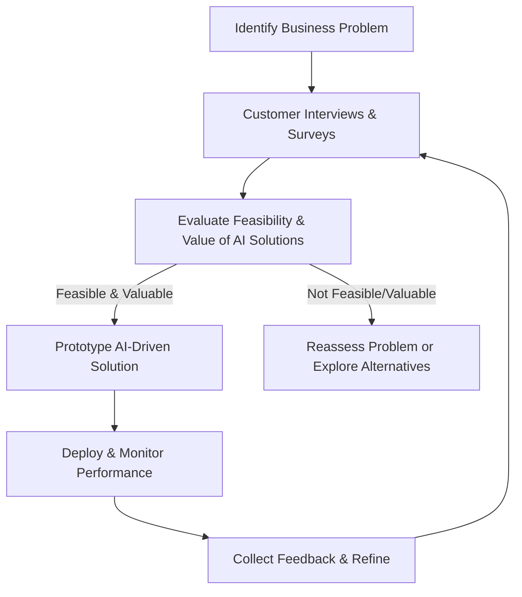

In the fast-moving realm of Machine Learning (ML), Generative AI (GenAI), and Retrieval-Augmented Generation (RAG), it can be tempting to jump straight into sophisticated models or cutting-edge toolkits. Yet the most critical first step is often overlooked: **clearly defining the business problem you aim to solve.** By taking a problem-first approach, you ensure that your AI initiatives address genuine needs, align with customer expectations, and deliver measurable value. In this article, you'll discover how to pinpoint tasks that benefit from automation or augmentation, assess feasibility and business impact, and ultimately implement AI solutions that boost your organization's performance.

## Why Problem-First Thinking Matters

Many organizations are intrigued by the possibilities of ML, GenAI, and RAG but mistakenly adopt these technologies simply to "stay ahead." AI should **never** be about hype; it should be about solving real challenges and delivering tangible results.

- **Identify Real-World Pain Points:** Focus on the specific issues that undermine your performance or customer experience.  
- **Validate Customer Needs:** Ensure that your proposed solution aligns with the priorities of those you serve.  
- **Evaluate Feasibility and Value:** Look holistically at technical readiness, ROI potential, and downstream benefits before allocating substantial resources.

:::important[Ask yourself]
*"What is the exact challenge I am trying to solve, and does AI truly add value here?"* If you can't articulate the problem in a single sentence to a non-technical stakeholder, you're likely not ready for an AI solution yet.
:::

---

## Defining the Opportunity: Automate Tasks, Not Jobs

Despite concerns about AI replacing entire roles, the reality is more nuanced. **AI excels at automating or augmenting discrete tasks**, freeing human workers to focus on creativity, strategic thinking, or relationship-building.

1. **Task Automation:** Ideal for repetitive, rules-based activities (e.g., sorting email inquiries or generating weekly sales reports).  
2. **Task Augmentation:** Suitable for complex tasks that benefit from AI-driven support (e.g., using an AI to assist in content generation or in complex customer support tasks).

:::note[Ask Yourself]
*What routine tasks eat up most of your employees' time, and how could you redeploy them to higher-value work with AI assistance?*
:::

---

## Evaluating AI Suitability: Technical Feasibility and Business Value

Deciding which tasks merit automation or augmentation requires balancing **technical feasibility** (TF) with **business value** (BV). Consider:

1. **Technical Feasibility (TF)**  
      - Data availability and quality  
      - Model complexity  
      - Infrastructure readiness  

   $$
   TF = f(\text{data quality}, \text{model complexity}, \text{infrastructure capacity})
   $$

2. **Business Value (BV)**  
      - Potential cost savings  
      - Time-to-market improvement  
      - Enhanced customer satisfaction  

   $$
   BV = f(\text{cost reduction}, \text{operational efficiency}, \text{user satisfaction})
   $$

Combine these factors to prioritize high-impact initiatives:

$$
\text{Score}(i) = \alpha \cdot TF(i) + \beta \cdot BV(i)
$$

where $\alpha$ and $\beta$ reflect your strategic weighting of feasibility versus value.

---

## Engaging With Customers for Problem Discovery

Involve your customers (and end users) early and often to confirm that the pain points you've identified are real and pressing.  

- **Conduct Interviews & Surveys:** Gather direct feedback on their biggest frustrations and desired improvements.  
- **Prototype & Demo:** Test AI-driven concepts with a small subset of users to validate effectiveness.  
- **Iterate Based on Feedback:** Continually refine your approach in response to real-world usage data.

:::note[Ask Yourself]
*How often do you directly ask customers which improvements they want, instead of guessing or relying on internal assumptions?*
:::

:::tip[Pro Tip]
Maintain a continuous feedback loop, integrating user insights at every stage to ensure your AI solutions remain aligned with evolving customer expectations.
:::

---

## Practical Steps for AI Integration  

Below is a refined, step-by-step approach to incorporating GenAI, RAG, or broader ML techniques into your enterprise. These guidelines cover the technical aspects of designing and deploying AI solutions and emphasize the importance of **evaluations** and a **data flywheel** strategy to continuously improve your models using user-generated data.

---

### 1. Map Out Current Workflows

1. **Diagram Existing Processes**  
   Identify where repetitive tasks, information bottlenecks, or latency issues exist. These weak points are prime candidates for AI-driven optimization.

2. **Pinpoint High-Impact Areas**  
   Prioritize tasks based on your specific business objectives (e.g., improving customer satisfaction, reducing operational costs, or boosting conversion rates).

:::note[Ask Yourself]
*How many daily workflows in your organization could be automated or intelligently enhanced if given accurate predictions or personalized insights?*
:::

---

### 2. Model & Architecture Selection

1. **Assess Complexity**  
   Determine whether a simpler ML technique (like logistic regression) suffices or whether a more advanced architecture—such as a Large Language Model (LLM) or RAG-based system—is necessary.

2. **Align with Task Requirements**  
   Choose an approach that fits the nature of your data and the level of precision required. For tasks with limited data or narrow domains, a specialized model may outperform an overgeneralized one.

:::tip[Pro Tip]
**Start small** with proof-of-concept models. Scale up your architecture only after initial results confirm that a more sophisticated technique is warranted.
:::

---

### 3. Data Preparation & Flywheel Setup

1. **Data Collection & Cleaning**  
   Gather relevant datasets and standardize them (e.g., consistent formats, clear labeling). High-quality data is crucial for robust modeling.  

2. **Design a Data Flywheel**  
      - **What is a Data Flywheel?**  
      A self-reinforcing loop in which **every user interaction** feeds back into the system, improving the model's accuracy and user experience over time.  
      - **How to Implement:**  
         - Integrate **user feedback loops** (like thumbs-up/down or brief surveys) at key interaction points.  
         - Capture **usage patterns** (e.g., click-through rates, dwell times, or purchase behaviors) to refine your model continuously.  
         - Establish a **pipeline** that processes this data, retrains the model, and rolls out incremental updates in a seamless manner.

:::warning[Warning]
Aim for simplicity when collecting feedback; overly complicated rating systems can lead to data bloat and reduced user engagement.
:::

---

### 4. Iterative Training and Fine-Tuning

1. **Initial Training**  
   Train your model on curated, representative data. If using a Large Language Model or GenAI approach, consider domain-specific fine-tuning to capture the nuances of your industry.

2. **User Feedback Loop**  
   Incorporate user interactions into your training pipeline. For instance, if customers frequently reject certain AI-generated suggestions, analyze that data to refine your models.

3. **Progressive Enhancement**  
   Roll out new model versions incrementally, monitoring performance metrics to validate improvements before a full-scale deployment.

:::tip[Pro Tip]
Make your retraining process **modular**. By structuring data flows in discrete steps, you can swap or upgrade models without overhauling the entire pipeline.
:::

---

### 5. **Evaluation**

1. **Define Quantitative Metrics**  
   Evaluate accuracy, precision, recall, or domain-specific metrics (e.g., customer satisfaction scores). Choose metrics that clearly indicate whether the AI solution meets your predefined objectives.

2. **Compare Against Baselines**  
   Test your model against non-AI methods or previously deployed systems. This helps quantify how much real value the new approach delivers.

3. **Qualitative Assessments**  
   Gather feedback from end users through interviews, surveys, or usability studies. Often, user sentiment reveals insights that raw numbers do not.

---

### 6. Integration & Deployment

1. **Pilot Rollout**  
   Introduce your AI feature to a small group of users or an isolated business unit. Monitor performance, gather user feedback, and address potential roadblocks early.

2. **Broader Deployment**  
   Once the pilot demonstrates stable results, integrate the AI-driven solution into main workflows. Secure executive support and cross-functional buy-in to smooth the transition.

3. **Change Management**  
   Train your teams on new processes and clarify the roles AI tools will play. Provide user-friendly documentation and ongoing support.

---

### 7. Ongoing Monitoring & Continuous Improvement

1. **Real-Time Analytics**  
   Track performance in production environments. Monitor latency, error rates, user engagement trends, and other operational metrics in near real-time.

2. **Regular Audits**  
   Schedule periodic reviews of model performance, data quality, and alignment with business objectives. This helps identify drift or degradation before it affects users.

3. **Iterative Enhancement**  
   Use the data from your flywheel to continuously refine your models. This might include retraining with new user data, experimenting with updated architectures, or fine-tuning existing solutions.

---

## Taking the First Step: A Quick-Start Guide

If you're ready to incorporate AI into your business processes but feel unsure where to begin, try this streamlined approach:

1. **Assemble a Cross-Functional Team**  
   Include business stakeholders, domain specialists, technical experts, and end-users to ensure comprehensive problem identification.

2. **Run a Problem Discovery Workshop**  
   Dedicate at least a half-day session to mapping out current pain points, identifying high-value opportunities, and aligning on success criteria.

3. **Prioritize Three Potential Use Cases**  
   Analyze the technical feasibility and business value of each scenario, selecting the most promising opportunity for a proof-of-concept.

4. **Build a Minimal Viable Product (MVP)**  
   Develop a streamlined AI solution that addresses the core problem without complex features. Focus on gathering user feedback over achieving perfect accuracy initially.

5. **Measure & Refine**  
   Collect data on the MVP's performance, user satisfaction, and business impact, using these insights to shape your subsequent iterations and investments.

---

## Conclusion: Value Creation, Not Technology Implementation

At its core, effective AI integration is about creating value through deliberate problem-solving—not implementing technology for its own sake. By structuring your AI journey with the problem-first approach outlined in this article, you can:

- **Avoid the Hype Trap:** Look beyond trendy tools to focus on measurable outcomes.  
- **Make Smarter Investments:** Allocate resources to AI initiatives with a clear ROI.  
- **Build Internal Expertise:** Develop your organization's ability to identify and solve problems using AI-powered solutions.  
- **Balance Innovation with Pragmatism:** Stay at the forefront of AI capabilities while maintaining a focus on practical business results.

The most successful AI implementations begin with the most fundamental questions: "What problem are we really trying to solve?" and "How will this solution create value for our customers or organization?" Start there, and the rest will follow. 